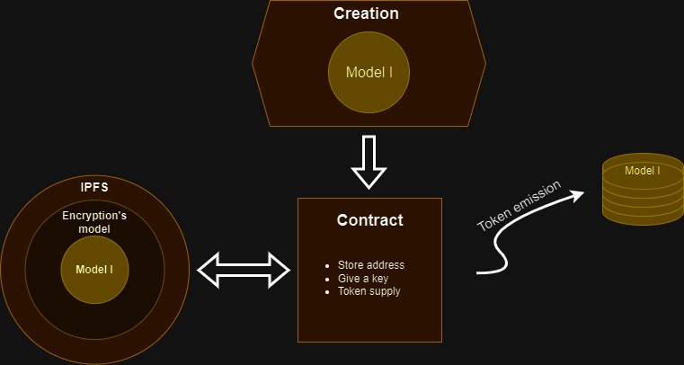

# Delea

Le projet Delea vise à décentraliser l'apprentissage machine en utilisant des contrats intelligents pour gérer et distribuer des modèles de deep learning. Les utilisateurs peuvent créer des modèles et les déployer sur des contrats qui émettent des jetons fixes et non modifiables. Le contrat permet d'entraîner le modèle et d'inférer en échange de jetons. La distribution des jetons est fixée à l'avance et la distribution est faite en fonction du nombre de jeton possédé par le contrat.

## Architecture

### Demo Entrainement dans le web 

## Création d'un modèle

### Déploiment du Contrat

1. Un utilisateur crée un modèle de Deep Learning compilé avec Wasm (Rust + Burn pour créer les modèles).
2. Une fois créé, l'utilisateur déploie son modèle sur un Smart Contrat prévu à cet effet.

### Smart Contrat

1. Lorsque le contrat est créé, un nombre de jeton est fixé et ne pourra jamais être modifié.
2. Le créateur reçoit 5% de la pool et l'accès à la fonction RollBack
3. Le contrat expose 2 fonctions publiquement train et infere.
    1. Train: Entraine le modèle directement dans le browser (ou wasm runtime) et reçoit une récompense une fois le retour de l'environnement.
    2. Infere: Envoie des jetons au contrat en échange, le contrat lui permet d'utiliser le modèle.
4. Les 2 plus gros holders de jeton ont accès à la fonction RollBack

Si il y a un conflit entre le créateur et les holders, les holders gagneronts.

### Modèle de distribution de jetons

1. Aucune inflation n'est possible car le nombre de jeton créé est fixé à la création du contrat et ne pourra plus jamais être modifié.
2. Un fractionnement des jetons est cependant possible. (Fonctionnalité à discuter)
3. La distribution ce fera avec une fonction qui permmettra aux premiers long train du modèle recevront plus que les prochains.

#### Fonction de distribution

##### Propriétés :

1. $\int_{x>=0}^{+\infty} f(x) \, dx = R,\quad\text{avec } R \text{ ce qui reste de jeton dans le contrat }$
2. $\lim_{x \to +\infty} f(x) = 0$
3. $\forall x_1, x_2,\quad x_1 < x_2 \implies f(x_1) > f(x_2)$

##### Solution :

$f(x) = \frac{R\cdot\alpha\}{u}\cdot\exp(-\frac{\alpha \cdot x}{u}),\ \forall u, \alpha > 0\text{ avec }\alpha\text{ le facteur de rapidité, }u \text{ le facteur d'update et }x\text{ le nombre d'uptade effectuer}$

#### Jeton

1. Les jetons sont transferables
2. Lorsqu'on utilise le modèle, nous transferons des jetons vers le contrat, le prix est fixé par la fonction de distribution. 
3. Les jetons sont divisables

### Sécurité

1. Le modele est public
2. Le modele ne peut pas etre utilisable sans une interaction avec le contrat
3. Cette autorisation doit etre actif de façon temporaire (nombre d'inference ou d'uptade)
4. Cette autorisation ne dois pu fonctionner une fois la limite d'utilisation utilisé

### Stockage

Utilisation de IPFS (InterPlanetary File System) pour stocker les modèles.

### Système de validation

Mise en place d'un système de validation: lors de l'update d'un utilisateur les récompenses seront bloquées jusqu'à ce que d'autres utilisateurs valident (avant d'entrainer à son tour) pour libérer la récompense.

### Donnée d'entrainement

Pour l'instant, des modèles de type self-learning seront disponibles.
Une solutions pour l'entrainement de la data pourra être développée par la suite.

### Asyncronité de l'entrainement

Pour l'instant aucune mesure pour règler ce problème, mais des mesures arrivent.
Pour le moment, l'entrainement se fera de façon synchrone avec une file d'attente en fonction de la puissance de calcul de l'utilisateur.

### Quantization

In comming...
